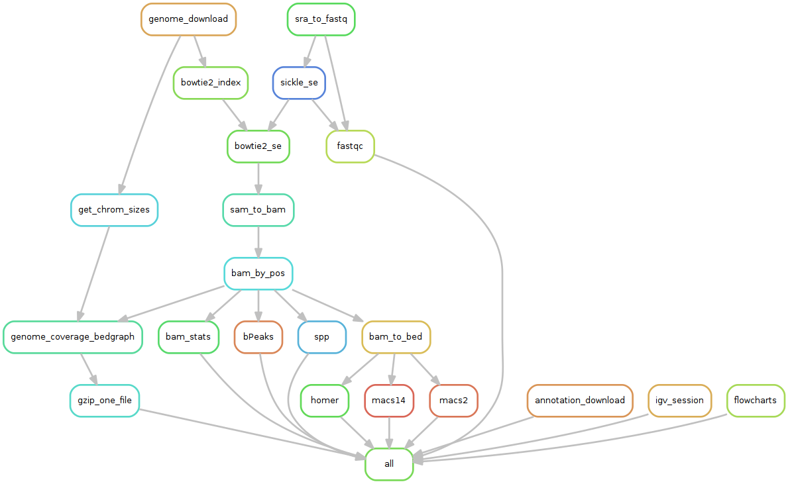

This git repository holds shared code for the analysis of Next
Generation Sequencing data related to gene regulation: ChIP-seq,
RNA-seq, and related technologies. 

We have chosen to use the [Snakemake workflow management system](https://bitbucket.org/snakemake/snakemake/wiki/Home)[1] 
in order to build reproducible and flexible NGS analysis pipelines.

**Full tutorials** can be found in the doc section, including the creation of a virtual machine/docker container, the installation of the tools and dependencies and the execution of the workflows: [`doc/gene-regulation_tutorials`](doc/gene-regulation_tutorials).

# Snakemake workflows

Snakemake is a tool that enables the creation of analysis pipelines, based on the python language and the make concepts of rules and targets. 

A rule contains the commands to generate a given target. 
A workflow can be defined as a series of files generated by successive rules. 

Here, we present a repository of reusable NGS-specific rules, as well as a few workflow examples for standard ChIP-seq and RNA-seq analyses. 

**A tutorial on Snakemake** basic usage is available in the doc section: [`doc/snakemake_tutorial`](doc/snakemake_tutorial).

# Workflow example

Our workflows are meant to work using two main files: a so-called workflow file (\*.py) and a configuration file (\*yml).
The first one contains the targets to be generated, and the second one contains the necessary and optional parameters 
to manage and customize the workflow. 

Here, we will show how to execute the ChIP-seq workflow [`factor_workflow.py`](https://github.com/rioualen/gene-regulation/blob/master/scripts/snakefiles/workflows/factor_workflow.py).

In the [example directory](https://github.com/rioualen/gene-regulation/blob/master/examples) you will find several case studies. We will use the `GSE20870` yeast study. It comes with two tab-delimited files: 

* `samples.tab` contains a description of each samples;
* `design.tab` contains the samples to be compared. 

The `yml` configuration file contains the paths to the data to be analysed, as well as the data to be generated. 
Here, we analyse raw samples (\*.sra) located in the `/data/source` directory. You can download it from the GEO platform:

```
sudo mkdir -p /data/source/GSE20870/GSM521934 /data/source/GSE20870/GSM521935
sudo mkdir -p /data/results/GSE20870

cd /data/source/GSE20870/GSM521934
wget ftp://ftp-trace.ncbi.nlm.nih.gov/sra/sra-instant/reads/ByExp/sra/SRX%2FSRX021%2FSRX021358/SRR051929/SRR051929.sra
cd /data/source/GSE20870/GSM521935
wget ftp://ftp-trace.ncbi.nlm.nih.gov/sra/sra-instant/reads/ByExp/sra/SRX%2FSRX021%2FSRX021359/SRR051930/SRR051930.sra
```

The reference genome will be automatically downloaded in the `/data/genomes` directory:

```
/data
    /genomes
        /sacCer2
            /sacCer2.fa
```

You should adapt the configuration file required fields to your own file organization. 

# Workflow execution

The [workflow](scripts/snakefiles/workflows/factor_workflow.py) includes the configuration file using this code:
```
configfile: "examples/GSE20870/GSE20870.yml"
```
You can chose what program(s) to use for mapping and peak-calling by commenting/uncommenting the following lines:

```
ALIGNER=[
#    "bowtie",
    "bowtie2",
#    "bwa"
]
```
```
PEAKCALLER=[
    "homer-fdr" + config["homer"]["fdr"] + "_peaks", 
    "macs2-qval" + config["macs2"]["qval"], 
#    "swembl-R" + config["swembl"]["R"],
    "macs14-pval" + config["macs14"]["pval"],
    "spp-fdr" + config["spp"]["fdr"],
#    "bPeaks_allGenome"
]
```

Note that the SWEMBL peak-caller currently doesn't work. 

You can now run the workflow by typing, from the `gene-regulation` directory:
```
snakemake -s scripts/snakefiles/workflows/factor_workflow.py -p
```

The workflow generates a flowchart of the analysis:




# Purpose of this repository

This git repository holds shared code for the analysis of Next
Generation Sequencing data related to gene regulation: ChIP-seq,
RNA-seq, and related technologies.

The goals are multiple.

1. Avoid duplication of efforts by sharing the developments of
different bioinformaticians involved in ChIP-seq and RNA-seq projects.

2. Ensure portability and re-usability of the code.

3. Enable validation of the code by independent users.


# Pre-requisites

We recommand using one of our [tutorials on virtualization](doc/gene-regulation_tutorials), in order to run the workflows under a unix system without damaging your installation. 

However, this repository contains a makefile that installs all the tools and dependencies used by gene-regulation. 

```
make -f scripts/makefiles/install_tools_and_libs.mk all
source ~/.bashrc
```

It includes:

* R 3+
* Python 2.7/3.4
* Snakemake 3.4+
* [SRA Toolkit](http://www.ncbi.nlm.nih.gov/Traces/sra/sra.cgi?view=software)
* [Sickle](https://github.com/najoshi/sickle)
* BWA
* Bowtie
* [Bowtie 2](http://bowtie-bio.sourceforge.net/)
* [SAMtools 1.3+](http://samtools.sourceforge.net/)
* [FastQC](http://www.bioinformatics.babraham.ac.uk/projects/fastqc/)
* [bedtools](http://bedtools.readthedocs.org/)
* [HOMER](http://homer.salk.edu/homer/index.html)
* MACS 14
* [MACS2](https://github.com/taoliu/MACS/)
* [SWEMBL](http://www.ebi.ac.uk/~swilder/SWEMBL/)
* ... (to be updated)


# Documentation

More documentation can be found in the `doc` directory.

It includes: 

* A Snakemake tutorial section (`snakemake_tutorial`)
* General tutorials on NGS tools installation, RSAT installation... (`install_protocols`)
* Instructions for building a virtual machine on the IFB cloud / under VirtualBox / using a Docker image in order to run a snakemake workflow (`gene-regulation_tutorials`)


Some general information about NGS can be found in the **Wiki** section. 


# Contact

- Claire Rioualen <claire.rioualen@inserm.fr>
- Jacques van Helden <Jacques.van-helden@univ-amu.fr>

# References 

1. Köster, Johannes and Rahmann, Sven. "Snakemake - A scalable bioinformatics workflow engine". Bioinformatics 2012.
